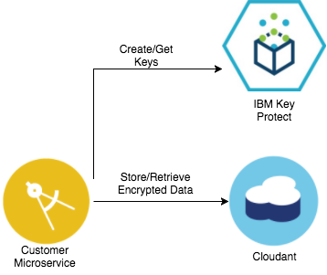

# Customer Microservice
*This project is part of the 'IBM Cloud Native Reference Architecture' suite, available at
https://github.com/ibm-cloud-architecture/refarch-cloudnative*

## Introduction

This project demonstrates how to build a Microservices application implemented as a Spring Boot application and deployed in a docker container.  It provides basic operations of creating and querying customer profiles from [IBM Cloudant](https://console.ng.bluemix.net/docs/services/Cloudant/index.html#Cloudant) NoSQL database as part of the Customer Profile function of BlueCompute.  Additionally the [Auth Microservice](https://github.com/ibm-cloud-architecture/refarch-cloudnative-auth) calls this microservice to perform Customer username/password authentication.  This project covers the following technical areas:

>- Build a microservice as a Spring Boot Java application
- Deploy the Customer microservice as a container on the [IBM Bluemix Container Service](https://console.ng.bluemix.net/docs/containers/container_index.html).
- Register the container with Eureka service registry (part of [Spring Cloud Netflix project](http://cloud.spring.io/spring-cloud-netflix/)
- Persist Customer data in an [IBM Cloudant](https://console.ng.bluemix.net/docs/services/Cloudant/index.html#Cloudant) NoSQL database using the official [Cloudant Java library](https://github.com/cloudant/java-cloudant).
- Generate and retrieve keys from [IBM Key Protect](https://console.ng.bluemix.net/catalog/services/key-protect/) to AES encrypt the password fields in the database.



### REST API

The Customer Microservice REST API is behind the Zuul Proxy, which validates the caller using signed JWT tokens.  As such, only API exposed by API Connect are considered public API.  All Public REST API are OAuth 2.0 protected by the API Connect OAuth provider.  

- `GET /micro/customer` (public)
  - Returns all customers.  The caller of this API must pass API Connect a valid OAuth token.  API Connect will pass down the customer ID in the `IBM-App-User` header.  A JSON object array is returned consisting of only users that match the customer ID (either length 0 or 1).

- `GET /micro/customer/{id}` (public)
  - Return customer by ID.  The caller of this API must pass API Connect a valid OAuth token.  API Connect will pass down the customer ID in the `IBM-App-User` header.  If the `id` matches the customer ID passed in the `IBM-App-User` header, it is returned as a JSON object in the response; otherwise `HTTP 401` is returned.

- `GET /micro/customer/search` (private)
  - Return customer by username.  This API is called by the [Auth Microservice](https://github.com/ibm-cloud-architecture/refarch-cloudnative-auth) when authenticating a user.  A JSON object array is returned consisting of only users that match the customer username (either length 0 or 1).

- `POST /micro/customer` (private)
  - Create a customer.  This API is not exposed to API Connect as user creation is not a supported function of the BlueCompute application.  The Customer object must be passed as JSON object in the request body with the following format:
    ```
    {
      "username": <username>,
      "password": <password>,
      "email": <email address>,
      "firstName": <first name>,
      "lastName": <last name>,
      "imageUrl": <image URL>
    }
    ```

    On success, `HTTP 201` is returned with the ID of the created user in the `Location` response header.

- `PUT /micro/customer/{id}` (private)
  - Update a customer record.  This API is not exposed to API Connect as updating the user profile is not a function of the BlueCompute application.  The full Customer object must be passed in the request body.

- `DELETE /micro/customer/{id}` (private)
  - Delete a customer record.  This API is not exposed to API Connect as deleting the user profile is not a function of the BlueCompute application.


## Pre-requisites

### Install Docker

Install [Docker](https://www.docker.com)

### Install Cloud Foundry CLI and IBM Containers plugin

Install the [Cloud Foundry CLI](https://console.ng.bluemix.net/docs/starters/install_cli.html) and the [IBM Containers Plugin](https://console.ng.bluemix.net/docs/cli/plugins/containers/index.html)

### Provision IBM Cloudant Database in Bluemix

*Note that two components use Cloudant in BlueCompute, the Customer microservice and the [Social Review microservice](https://github.com/ibm-cloud-architecture/refarch-cloudnative-micro-socialreview).  If deploying both components to the same space, they can share the Cloudant database instance, as the Customer microservice saves documents to the `customers` database, and the Social Review microservice saves documents to the `socialreviewdb` and `socialreviewdb-staging` databases.*

1. Login to your Bluemix console  
2. Open browser to create Cloudant Service using this link [https://console.ng.bluemix.net/catalog/services/cloudant-nosql-db](https://console.ng.bluemix.net/catalog/services/cloudant-nosql-db)  
3. Name your Cloudant service name like `refarch-cloudantdb`  
4. For testing, you can select the "Lite" plan, then click "Create"  
5. Once the service has been created, note the service credentials under `Service Credentials`.  In particular, the Customer microservice requires the `url` property.

### Provision IBM Key Protect service in Bluemix

1. Login to your Bluemix console
2. Open browser to create Key Protect service using this link [https://console.ng.bluemix.net/catalog/services/key-protect/](https://console.ng.bluemix.net/catalog/services/key-protect/)
3. Name your Key Protect service name like `refarch-keyprotect`.

## Deploy to BlueMix

You can use the following button to deploy the Customer microservice to Bluemix, or you can follow the instructions manually below.

The deployment will:

1. Discover and pass in the Cloudant credentials from the Cloudant instance in the space 
2. Pass the Pipeline's OAuth token and org and space GUIDs as Key Protect parameters (**Note that the Pipeline OAuth token expires after approximately one day, this is a demonstration not intended for production use**)
3. Provision a container group with the Customer Microservice in the Bluemix Container Service.  
4. Once the container group has been created, a user with the username 'foo' and password 'bar' is inserted into the database.

The toolchain contains optional parameters:
- `New Relic License Key` - enter the license key for New Relic agent integration.  
- `Eureka Registry URL` to register the Customer microservice with a Eureka registry

[](https://console.ng.bluemix.net/devops/setup/deploy?repository=https://github.com/jkwong888/refarch-cloudnative-micro-customer.git)

## Build the Docker container.

1. Build the application:

   ```
   # ./gradlew build
   ```

2. Copy the binaries to the docker container:
   
   ```
   # ./gradlew docker
   ```

3. Build the docker container
   ```
   # cd docker
   # docker build -t customer-microservice .
   ```
## Acquire the Key Protect parameters

1. Log into the Cloud Foundry CLI
   ```
   # cf login
   ```
   
   Be sure to set the correct target space where Cloudant instance was provisioned.
   
   ```
   # cf target
   ```
   
2. Get a Bluemix OAuth Token:
   ```
   # cf oauth-token
   bearer XXXXXXXXXXXXXXXXXXXXXXXXXXXXXX
   ```
   
   The relevant part appears after the `bearer`.  Copy this to the clipboard for later.
   
3. Acquire the Bluemix Org and Space GUID

   These two UUIDs are required by the Key Protect client in the Customer Microservice to call Key Protect REST APIs.
   
   ```
   # cf org <org-name> --guid
   # cf space <space-name> --guid
   ```
   

## Run the Docker container locally (optional)

Execute the following to run the Docker container locally.  Make sure to update the `<Eureka URL>`, and the `<Cloudant username>`, `<Cloudant password>`, `<Cloudant host>`, and `<Cloudant port>` retrieved from the `Service Credentials` tab in the Bluemix portal.  The `<space guid>`, `<org guid>`, and `<oauth-token>` were retrieved in the earlier step.

```
# docker run \
  --name customer-service \
  --publish 8080 \
  -e spring.application.cloudant.username=<Cloudant username> \
  -e spring.application.cloudant.password=<Cloudant password> \
  -e spring.application.cloudant.host=<Cloudant host> \
  -e spring.application.cloudant.port=<Cloudant port> \
  -e spring.application.cloudant.database=customers \
  -e spring.application.keyprotect.bluemix-space-guid=<space guid> \
  -e spring.application.keyprotect.bluemix-org-guid=<org guid> \
  -e spring.application.keyprotect.oauth-token=<oauth-token>
  customer-microservice
```

## Run the Docker container on Bluemix
1. Log into the Cloud Foundry CLI
   ```
   # cf login
   ```
   
   Be sure to set the correct target space where Cloudant instance was provisioned.
   
2. Initialize the Bluemix Containers plugin
   
   ```
   # cf ic init
   ```
   
   Ensure that the container namespace is set:
   ```
   # cf ic namespace get
   ```
   
   If it is not set, use the following command to set it:
   ```
   # cf ic namespace set <namespace>
   ```
   
3. Tag and push the docker image to the Bluemix private registry:

   ```
   # docker tag customer-microservice registry.ng.bluemix.net/$(cf ic namespace get)/customer-microservice
   # docker push registry.ng.bluemix.net/$(cf ic namespace get)/customer-microservice
   ```

4. Execute the following to run the container in a group on Bluemix Container Service.  Make sure to update the `<Eureka URL>`, and the `<Cloudant username>`, `<Cloudant password>`, `<Cloudant host>`, and `<Cloudant port>` retrieved from the `Service Credentials` tab in the Bluemix portal.  The `<space guid>`, `<org guid>`, and `<oauth-token>` were retrieved in the earlier step.  Create a unique `<route-name>` which can be used to call the REST API when validating the service (e.g. `my-customer-service`).

   ```
   # cf ic group create \
     --name customer-microservice \
     --hostname <route-name> \
     --domain mybluemix.net \
     --publish 8080 \
     -m 256 \
     -e spring.application.cloudant.username=<Cloudant username> \
     -e spring.application.cloudant.password=<Cloudant password> \
     -e spring.application.cloudant.host=<Cloudant host> \
     -e spring.application.cloudant.port=<Cloudant port> \
     -e spring.application.cloudant.database=customers \
     -e spring.application.keyprotect.bluemix-space-guid=<space guid> \
     -e spring.application.keyprotect.bluemix-org-guid=<org guid> \
     -e spring.application.keyprotect.oauth-token=<oauth-token>
     --desired 2 \
     --min 1 \
     --max 3 \
     registry.ng.bluemix.net/$(cf ic namespace get)/customer-microservice
   ```

## Validate the Customer microservice

### Create a Customer

Create a customer profile for the user `foo` with the password `bar`.  Make sure that you replace `<temp-routename>` with your temporary route.

```
# curl -X POST -H "Content-Type: application/json" -d '{"username": "foo", "password": "bar", "firstName": "foo", "lastName": "bar", "email": "foo@bar.com"}' -i https://<route-name>/micro/customer
HTTP/1.1 201 Created
X-Backside-Transport: OK OK
Connection: Keep-Alive
Transfer-Encoding: chunked
Date: Wed, 08 Feb 2017 21:41:31 GMT
Location: http://<route-name>/micro/customer/bff5631f24c849e8897645be8b66af16
X-Application-Context: zuul-proxy:8080
X-Global-Transaction-ID: 1311769839
```

Note the `Location` header returned, which contains the ID of the created customer.

### Get Customer

Verify the customer.  The caller must pass a header, `IBM-App-User`, to the API, to identify itself.  This header is passed by API Connect whan an authenticated user passes a valid Bearer token.  For testing, pass the header manually.

```
# curl -H "IBM-App-User: bff5631f24c849e8897645be8b66af16"  http://<route-name>/micro/customer
{"username":"foo","password":"bar","firstName":"foo","lastName":"bar","imageUrl":null,"customerId":"bff5631f24c849e8897645be8b66af16","email":"foo@bar.com"}
```

Note that *only* the customer object identified by `IBM-App-User` is returned to the caller.

### Search Customer by username

Call the `search` API to find the customer by username.  This API is used by the [Auth Microservice](https://github.com/ibm-cloud-architecture/refarch-cloudnative-auth) to authenticate users.  

```
# curl http://<route-name>/micro/customer/search?username=foo
[{"username":"foo","password":"bar","firstName":"foo","lastName":"bar","imageUrl":null,"customerId":"bff5631f24c849e8897645be8b66af16","email":"foo@bar.com"}]
```

### Validate data is encrypted

To validate that the data is in fact encrypted.
1. Log in to the Bluemix Portal.
2. Under `Services` -> `Data & Analytics`, locate the `refarch-cloudantdb` instance of Cloudant and click on it.
3. Under `Manage` tab, click on the `Launch` button to go to the Cloudant dashboard.
4. In the Cloudant dashboard, under `Database` tab, find the `customers` database and click on it.
5. Find the ID of the created user (e.g. `bff5631f24c849e8897645be8b66af16`).  Click on the ID to expand the record.
6. Check the `password` field in the JSON.  It should be encrypted.
7. Observe the `keyId` field.  This is the ID of the key used to encrypt the password.  
8. Return to the Bluemix Dashboard.  Under `Services` -> `Security`, find the `refarch-keyprotect` service and open it.
9. In the `Manage` tab, you will see the keys created by the microservice to encrypt the fields.
